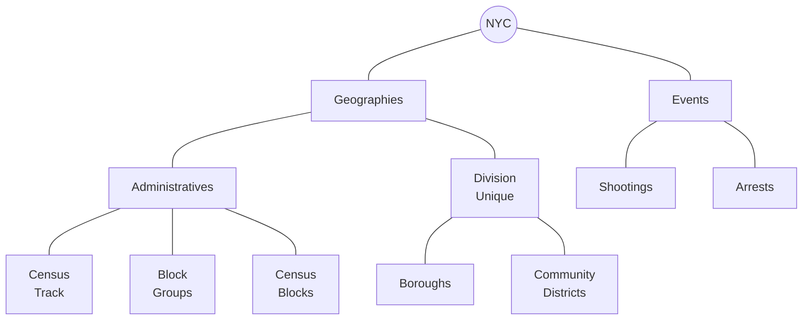

# Spatial Analysis using NYC criminal data
This repository is building R code to explore the NYC criminal data through diferent Spatial Methods. 


## 1.Getting data

#### Establishing connection with PostgresSQL

```R
#Working with the data --------------------------------------------------------
library(RPostgreSQL)
library(DBI)
library(sf)
library(rpostgis)
library(tidyverse)

fun_connect<-function(){dbConnect(RPostgres::Postgres(),
                                  dbname='censos',
                                  host='localhost',
                                  port=5432,
                                  user='postgres',
                                  password='adminpass',
                                  options= '-c search_path=censos'
)}

conn<-fun_connect()
```

### Setting up PostGIS

#### Seeing drivers
```R
# Seeing drivers ----------------------------------------------------------

st_drivers() %>% 
  filter(grepl("Post", name))

"PostgreSQL" %in% st_drivers()$name
```

Make reference to the [problem](https://github.com/r-spatial/sf/issues/60#issuecomment-1399338141)


#### Changing PostGIS schema

```SQL
dbSendQuery(conn, "UPDATE pg_extension
            SET extrelocatable = true
            WHERE extname = 'postgis';")
            
dbSendQuery(conn,"ALTER EXTENSION postgis
            SET SCHEMA censos;")
            
dbSendQuery(conn,"ALTER EXTENSION postgis
            UPDATE TO \"3.1.0\";")
            
dbSendQuery(conn,"ALTER EXTENSION postgis
            UPDATE TO \"3.1.0\";")
```

### Getting and loading data

#### Big database manually

```console
ogr2ogr -f PostgreSQL PG:"host=localhost dbname=censos user=postgres password=adminpass port=5432 schemas=censos ACTIVE_SCHEMA=censos" -lco SCHEMA=censos nypd-arrest-historic.geojson -lco GEOMETRY_NAME=geometry
```

#### Sf method
```#SF: To works, it was necessary to verify that postgis extension was associated to our schema 
sf::st_write(geojsonio::geojson_sf("https://data.cityofnewyork.us/resource/833y-fsy8.geojson?%24limit=5308876&%24%24app_token=PUTPERSONALTOKEN"),
             dsn= conn,
             layer="ny_shooting_historic",delete_layer=T,append=F,
             driver="PostgreSQL/PostGIS")
```

Databases to load 



