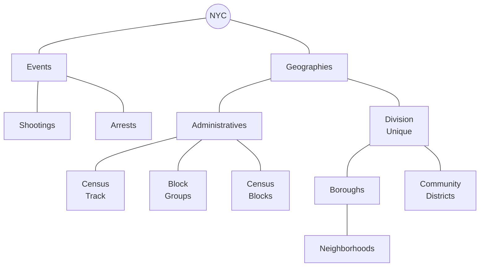

# Spatial Analysis using NYC criminal data
This repository is building R code to explore the NYC criminal data through diferent Spatial Methods. 


## 1.Getting data

#### Establishing connection with PostgresSQL

```R
#Working with the data --------------------------------------------------------
library(RPostgreSQL)
library(DBI)
library(sf)
library(rpostgis)
library(tidyverse)

fun_connect<-function(){dbConnect(RPostgres::Postgres(),
                                  dbname='censos',
                                  host='localhost',
                                  port=5432,
                                  user='postgres',
                                  password='adminpass',
                                  options= '-c search_path=censos'
)}

conn<-fun_connect()
```

### Setting up PostGIS

#### Seeing drivers
```R
# Seeing drivers ----------------------------------------------------------

st_drivers() %>% 
  filter(grepl("Post", name))

"PostgreSQL" %in% st_drivers()$name
```

Make reference to the [problem](https://github.com/r-spatial/sf/issues/60#issuecomment-1399338141)


#### Changing PostGIS schema

```SQL
dbSendQuery(conn, "UPDATE pg_extension
            SET extrelocatable = true
            WHERE extname = 'postgis';")
            
dbSendQuery(conn,"ALTER EXTENSION postgis
            SET SCHEMA censos;")
            
dbSendQuery(conn,"ALTER EXTENSION postgis
            UPDATE TO \"3.1.0\";")
            
dbSendQuery(conn,"ALTER EXTENSION postgis
            UPDATE TO \"3.1.0\";")
```

### Getting and loading data




### Events

#### Loading manually Arrest Events (big database >5M events)

```console
ogr2ogr -f PostgreSQL PG:"host=localhost dbname=censos user=postgres password=adminpass port=5432 schemas=censos ACTIVE_SCHEMA=censos" -lco SCHEMA=censos nypd-arrest-historic.geojson -lco GEOMETRY_NAME=geometry
```

#### Loading manually Shootings Events
```R
#SF: To works, it was necessary to verify that postgis extension was associated to our schema 
sf::st_write(geojsonio::geojson_sf("https://data.cityofnewyork.us/resource/833y-fsy8.geojson?%24limit=5308876&%24%24app_token=PUTPERSONALTOKEN"),
             dsn= conn,
             layer="ny_shooting_historic",delete_layer=T,append=F,
             driver="PostgreSQL/PostGIS")
```


### Boundaries

#### Administrative divisions

```R
#Census Track: https://data.cityofnewyork.us/City-Government/2020-Census-Tracts-Tabular/63ge-mke6
st_write(st_read("https://data.cityofnewyork.us/api/geospatial/63ge-mke6?accessType=DOWNLOAD&method=export&format=GeoJSON"),dsn = conn, 'ct_nyc')

#Census block: https://data.cityofnewyork.us/City-Government/2020-Census-Tracts-Tabular/63ge-mke6
st_write(st_read("https://data.cityofnewyork.us/api/geospatial/wmsu-5muw?accessType=DOWNLOAD&method=export&format=GeoJSON"),dsn = conn, 'block_nyc')
```
#### Unique division

```R
#Boroughs 
st_write(st_read("https://data.cityofnewyork.us/resource/7t3b-ywvw.geojson"),dsn = conn, 'borough_nyc')

#Community District
st_write(st_read("https://data.cityofnewyork.us/api/geospatial/xn3r-zk6y?accessType=DOWNLOAD&method=export&format=GeoJSON"),dsn = conn, 'cdta_nyc')

#Neighborhood
st_write(st_read("https://data.cityofnewyork.us/api/geospatial/9nt8-h7nd?accessType=DOWNLOAD&method=export&format=GeoJSON"),dsn = conn, 'neighborhood_nyc')

```

### Density

[Intensity and Density](https://paezha.github.io/spatial-analysis-r/point-pattern-analysis-i.html#intensity-and-density)

$$\lambda=\frac{number of event}{unit area} $$

```R
#Querying shootings
shooting_block <- st_read(conn,query="SELECT block_nyc.geoid, count(nypd_shooting_historic.geometry)
                                       FROM block_nyc
                                       LEFT JOIN nypd_shooting_historic ON st_contains(block_nyc.geometry, nypd_shooting_historic.geometry)
                                       GROUP BY block_nyc.geoid;")

#Querying arrest
arrests_block <- st_read(conn,query="SELECT block_nyc.geoid, count(nypd_arrest_historic.geometry)
                                       FROM block_nyc
                                       LEFT JOIN nypd_arrest_historic ON st_contains(block_nyc.geometry, nypd_arrest_historic.geometry)
                                       GROUP BY block_nyc.geoid;")
```

#### Joining tabular response to a geometry
```R
#Shooting
shooting_block <- left_join(shooting_block, st_read(conn,layer = "block_nyc"), by="geoid")|> st_as_sf()
#Arrest
arrests_block <- left_join(arrests_block, st_read(conn,layer = "block_nyc"), by="geoid")|> st_as_sf()
```
#### Ploting the results
```
#Ploting shootings
ggplot()+
  geom_sf(data=shooting_block,aes(fill=as.integer(count)),colour=NA)+
  scale_fill_gradient(low = 'pink', high='red', na.value = 'yellow')+
  labs(fill='Number of Shootings', title='Number of Shootings')+
  geom_sf(data = st_read(conn,layer = 'neighborhood_nyc'), fill=NA, linewidth = 0.5, color='green')+
  geom_sf(data = st_read(conn,layer = 'borough_nyc'),fill=NA, linewidth = 1.3 ,color='gray')
```

```
#Ploting arrests
ggplot()+
  geom_sf(data=arrests_block,aes(fill=as.integer(count)),colour=NA)+
  scale_fill_gradient(low = 'pink', high='red', na.value = 'yellow')+
  labs(fill='Number of Arrests' , title='Number of Arrest')+
  geom_sf(data = st_read(conn,layer = 'neighborhood_nyc'), fill=NA, linewidth = 0.5, color='green')+
  geom_sf(data = st_read(conn,layer = 'borough_nyc'),fill=NA, linewidth = 1.3 ,color='gray')
  
```
